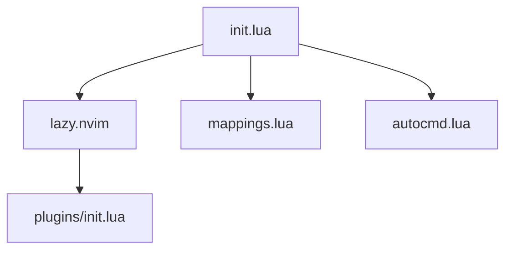

#### Start
```zsh
git clone git@github.com:FukeKazki/nvim-term.git ~/.config/nvim-term
NVIM_APPNAME=nvim-term nvim
```

#### Structure



#### Link

- https://github.com/FukeKazki/nvim-term/tree/main
