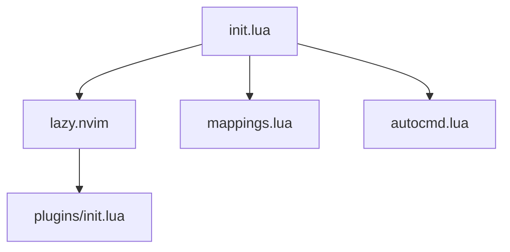
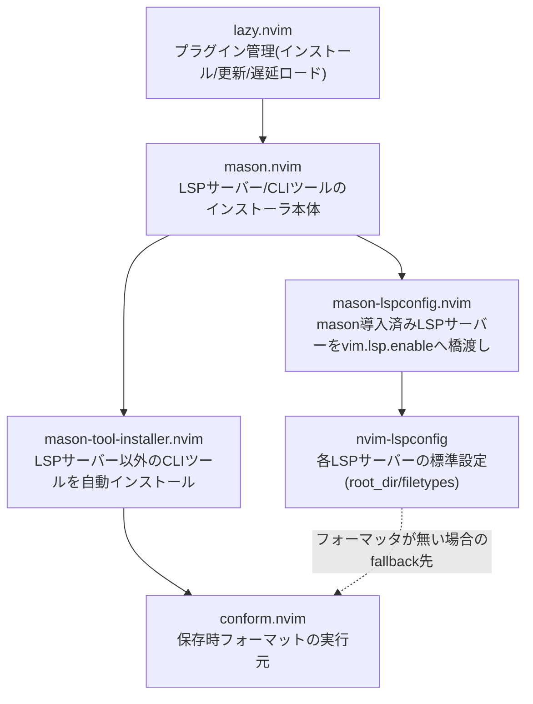

#### Start
```zsh
git clone git@github.com:FukeKazki/nvim-term.git ~/.config/nvim-term
NVIM_APPNAME=nvim-term nvim
```

#### Structure


```mermaid
graph TD;
  init.lua --> lazy.nvim --> plugins/init.lua
  init.lua -->  mappings.lua
  init.lua -->  autocmd.lua
```

#### Responsibility

LSP/フォーマッタ/リンター周りは登場するツールが多く役割が混同しがちなので、責務を明記しておく。


```mermaid
graph TD;
  lazy["lazy.nvim<br/>プラグイン管理(インストール/更新/遅延ロード)"] --> mason["mason.nvim<br/>LSPサーバー/CLIツールのインストーラ本体"]
  mason --> mlsp["mason-lspconfig.nvim<br/>mason導入済みLSPサーバーをvim.lsp.enableへ橋渡し"]
  mason --> mti["mason-tool-installer.nvim<br/>LSPサーバー以外のCLIツールを自動インストール"]
  mlsp --> lspconfig["nvim-lspconfig<br/>各LSPサーバーの標準設定(root_dir/filetypes)"]
  mti --> conform["conform.nvim<br/>保存時フォーマットの実行元"]
  lspconfig -.フォーマッタが無い場合のfallback先.-> conform
```

- **lazy.nvim**: すべてのプラグインのインストール/更新/遅延ロードを司る大元。`lua/plugins/init.lua`が定義の一覧
- **mason.nvim**: LSPサーバーやCLIツール(フォーマッタ/リンター)本体をインストールするだけの存在。単体ではNeovimに何もアタッチしない
- **mason-lspconfig.nvim**: mason経由でインストールしたLSPサーバーを`vim.lsp.config`/`vim.lsp.enable`に自動登録する橋渡し役(`lua/lsp.lua`の`ensure_installed`)
- **nvim-lspconfig**: 各LSPサーバーの`root_dir`/`filetypes`などの標準設定プリセット集。`ts_ls`/`denols`のように独自の`root_markers`で上書きすることもある
- **mason-tool-installer.nvim**: `mason-lspconfig`の対象外(LSPサーバーではない単体CLI、例: `stylua`/`prettierd`/`biome`/`oxfmt`)を自動インストールする係
- **conform.nvim**: 保存時フォーマットの実行元。プロジェクトごとの設定ファイル(`biome.json`/`.oxfmtrc.json`/`.prettierrc`等)の有無で使うフォーマッタCLIを`formatters_by_ft`の優先順位に従って切り替え、該当が無ければLSP(`ts_ls`など)のフォーマットにフォールバックする

##### null-ls (none-ls.nvim) を使わない理由

以前はフォーマット(`prettierd`/`stylua`)とlint(`eslint`)の両方を`null-ls`(開発終了後は`none-ls.nvim`)経由で扱っていたが、

- lintは`eslint`のネイティブLSP(mason-lspconfig経由)で完全に代替できる
- フォーマットは`conform.nvim`で完全に代替できる

ため撤去した。`none-ls.nvim`自体も公式にフォーマット用途は`conform.nvim`、lint用途は`nvim-lint`への移行を推奨している。今は非LSPのリンター(stylelintやshellcheckなど)を使っていないため`nvim-lint`は未導入。必要になったタイミングで追加する。

#### Link

- https://github.com/FukeKazki/nvim-term/tree/main
